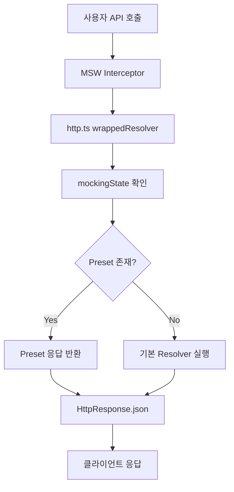

# msw-scenarios 아키텍처 분석 보고서

## 1. 프로젝트 개요

msw-scenarios는 MSW(Mock Service Worker) 2.x를 확장하여 preset 기반의 API 모킹 시스템을 제공하는 TypeScript 라이브러리입니다.

### 핵심 가치

- **Preset 시스템**: 미리 정의된 응답 시나리오를 쉽게 전환
- **타입 안정성**: TypeScript를 통한 완전한 타입 추론
- **프로필 관리**: 여러 preset을 그룹화하여 관리

### 기술 스택

- TypeScript 5.6.3
- MSW 2.6.6 (peer dependency)
- Immer (상태 불변성)
- Vite (빌드 도구)
- Jest & Playwright (테스팅)

## 2. 현재 아키텍처 분석

### 2.1 모듈 구조

```
src/
├── http.ts           # MSW HTTP 메서드 래핑 (141 lines)
├── extendHandlers.ts # 핸들러 확장 및 프로필 관리 (247 lines)
├── mockingState.ts   # 전역 상태 관리 (51 lines)
├── worker.ts         # MSW 워커/서버 관리 (86 lines)
├── types.ts          # 타입 정의 (224 lines)
└── store/
    ├── createStore.ts # 상태 저장소 (24 lines)
    └── stores.ts      # 스토어 인스턴스 (88 lines)
```

### 2.2 데이터 흐름



### 2.3 상태 관리 패턴

- **전역 싱글톤**: `mockingState`와 `workerManager`
- **Immer 기반**: 불변성 보장
- **구독 패턴**: 상태 변경 알림

## 3. 강점 분석

### 3.1 우수한 개발자 경험

- 직관적인 API 설계
- 체이닝 방식의 preset 정의
- 타입 자동 추론

### 3.2 작은 번들 사이즈

- ES Module: 23KB
- UMD: 16KB
- MSW를 external로 처리

### 3.3 실용적인 기능

- 프로필 기반 시나리오 관리
- 동적 응답 override
- React 통합 가능

## 4. 주요 문제점 및 개선안

### 4.1 🔴 과도한 타입 복잡도

**문제점**

```typescript
// 7개의 제네릭 파라미터
export interface PresetHandler<
  T = any,
  M extends HttpMethodLiteral = HttpMethodLiteral,
  P extends Path = Path,
  L extends string = string,
  R = any,
  Params extends PathParams = PathParams,
  ReqBody extends DefaultBodyType = DefaultBodyType,
>
```

**개선안**

```typescript
// 필수 파라미터만 노출, 나머지는 유틸리티 타입으로 추론
export interface PresetHandler<Response = any> {
  method: HttpMethod;
  path: string;
  presets: Preset<Response>[];
  // 내부 타입은 private으로 관리
}
```

**영향도**: High | **노력**: Low | **우선순위**: 1

### 4.2 🔴 프로토타입 조작으로 인한 디버깅 어려움

**문제점**

```typescript
const handler = Object.create(base, {
  _method: { value: method, enumerable: true },
  // 프로토타입 체인 조작
});
```

**개선안**

```typescript
class PresetHandler implements Handler {
  constructor(
    private method: HttpMethod,
    private path: string,
    private resolver: ResponseResolver
  ) {}

  presets(...presets: Preset[]) {
    this.presetList = presets;
    return this;
  }
}
```

**영향도**: High | **노력**: Medium | **우선순위**: 3

### 4.3 🟡 전역 상태로 인한 테스트 격리 문제

**문제점**

- 싱글톤 패턴으로 테스트 간 상태 공유
- 병렬 테스트 실행 불가

**개선안**

```typescript
// 의존성 주입 패턴
export function createMockingContext() {
  const state = createStore(initialState);
  const worker = createWorkerManager(state);

  return {
    http: createHttpHandlers(state),
    extendHandlers: createExtendHandlers(state, worker),
    worker,
  };
}

// 사용
const { http, extendHandlers, worker } = createMockingContext();
```

**영향도**: Medium | **노력**: High | **우선순위**: 5

### 4.4 🟡 React 통합 부재

**문제점**

- React Hook 미제공
- 상태 변경 감지 수동 구현 필요

**개선안**

```typescript
// hooks/useMockScenario.ts
export function useMockScenario(handlers: ExtendedHandlers) {
  const [status, setStatus] = useState(handlers.getCurrentStatus());

  useEffect(() => {
    return handlers.subscribeToChanges(({ status }) => {
      setStatus(status);
    });
  }, [handlers]);

  return {
    status,
    useMock: handlers.useMock,
    useProfile: handlers.createMockProfiles,
  };
}
```

**영향도**: High | **노력**: Low | **우선순위**: 2

### 4.5 🟡 낮은 테스트 커버리지 (mockingState: 38%)

**문제점**

- 핵심 모듈의 테스트 부족
- 엣지 케이스 미검증

**개선안**

- mockingState 단위 테스트 추가
- 통합 테스트 시나리오 확장
- 목표: 전체 85%, 핵심 모듈 90%

**영향도**: Medium | **노력**: Low | **우선순위**: 4

## 5. 실행 로드맵

### Phase 1: Quick Wins (1-2주)

1. **React Hook 제공**
   - `useMockScenario` hook 구현
   - 예제 및 문서 작성
2. **타입 단순화**
   - 공개 API 타입 정리
   - 내부 타입 private 처리
3. **테스트 커버리지 개선**
   - mockingState 테스트 추가
   - E2E 시나리오 확장

### Phase 2: 구조 개선 (3-4주)

4. **클래스 기반 리팩토링**
   - PresetHandler 클래스 구현
   - 기존 API 호환성 유지
5. **모듈 분리**
   - http.ts 책임 분산
   - preset 관리 로직 분리

### Phase 3: 장기 개선 (선택적)

6. **의존성 주입 패턴**
   - Context 기반 아키텍처
   - 다중 인스턴스 지원

## 6. 권장사항

### 즉시 실행 가능한 개선

1. **TypeScript 5.x 업그레이드** - 더 나은 타입 추론
2. **ESLint 규칙 강화** - 복잡도 제한 설정
3. **문서화 개선** - 아키텍처 다이어그램 추가

### 오버엔지니어링 회피

- ✅ 현재 번들 사이즈는 충분히 작음 (최적화 불필요)
- ✅ Immer 사용은 적절 (커스텀 불변성 관리 불필요)
- ✅ 기본 기능은 충분 (추가 기능보다 안정성 우선)

### 호환성 전략

- 모든 변경사항은 기존 API와 하위 호환
- 새로운 기능은 opt-in 방식으로 제공
- Breaking change는 메이저 버전에서만

## 7. 결론

msw-scenarios는 좋은 아이디어와 실용적인 기능을 가진 라이브러리입니다. 주요 개선 포인트는:

1. **타입 시스템 단순화**로 DX 개선
2. **React Hook 제공**으로 사용성 향상
3. **테스트 커버리지 개선**으로 안정성 확보
4. **점진적 리팩토링**으로 유지보수성 향상

이러한 개선을 통해 더 많은 개발자가 쉽게 사용할 수 있는 production-ready 라이브러리로 발전할 수 있을 것입니다.

---

_작성일: 2025-08-08_  
_작성자: Claude Code (Frontend Persona)_
